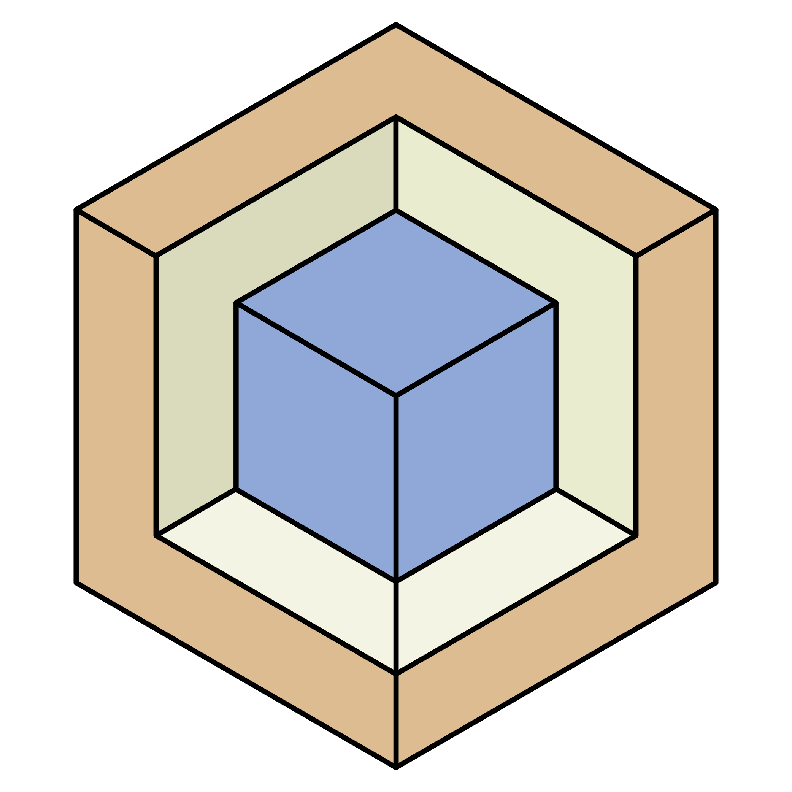

  
  <h1>InvenTree</h1>
  
Open Source Inventory Management System 

<!-- Badges -->

<h4>
    <a href="https://demo.inventree.org/">View Demo</a>
   · 
    <a href="https://inventree.readthedocs.io/en/latest/">Documentation</a>
   · 
    <a href="https://github.com/inventree/InvenTree/issues/new?template=bug_report.md&title=[BUG]">Report Bug</a>
   · 
    <a href="https://github.com/inventree/InvenTree/issues/new?template=feature_request.md&title=[FR]">Request Feature</a>
  </h4>

<!-- About the Project -->
## :star2: About the Project

InvenTree is an open-source Inventory Management System which provides powerful low-level stock control and part tracking. The core of the InvenTree system is a Python/Django database backend which provides an admin interface (web-based) and a REST API for interaction with external interfaces and applications.

InvenTree is designed to be lightweight and easy to use for SME or hobbyist applications, where many existing stock management solutions are bloated and cumbersome to use. Updating stock is a single-action process and does not require a complex system of work orders or stock transactions.

Powerful business logic works in the background to ensure that stock tracking history is maintained, and users have ready access to stock level information.

<!-- Features -->

### :dart: Features

- Organize Parts and BOMs
- Manage Suppliers
- Instant Stock Knowledge
- Extend and Customize to fit your usage

<!-- Roadmap -->
### :compass: Roadmap

* [x] Plugins
* [ ] Improved Importers
* [ ] Custom Workflow Processes

<!-- Integration -->
### :hammer_and_wrench: Integration

InvenTree is designed to be **extensible**, and provides multiple options for **integration** with external applications or addition of custom plugins:

* [InvenTree API](https://inventree.readthedocs.io/en/latest/extend/api/)
* [Python module](https://inventree.readthedocs.io/en/latest/extend/python)
* [Plugin interface](https://inventree.readthedocs.io/en/latest/extend/plugins)
* [Third party tools](https://inventree.readthedocs.io/en/latest/extend/integrate)

<!-- TechStack -->
### :space_invader: Tech Stack

  
Server

  <ul>
    <li><a href="https://www.python.org/">Python</a></li>
    <li><a href="https://www.djangoproject.com/">Django</a></li>
    <li><a href="https://www.django-rest-framework.org/">DRF</a></li>
    <li><a href="https://django-q.readthedocs.io/">Django Q</a></li>
    <li><a href="https://django-allauth.readthedocs.io/">Django-Allauth</a></li>
  </ul>

Database

  <ul>
    <li><a href="https://www.postgresql.org/">PostgreSQL</a></li>
    <li><a href="https://www.mysql.com/">MySQL</a></li>
    <li><a href="https://www.sqlite.org/">SQLite</a></li>
    <li><a href="https://redis.io/">Redis</a></li>
  </ul>

  
Client

  <ul>
    <li><a href="https://getbootstrap.com/">Bootstrap</a></li>
    <li><a href="https://jquery.com/">jQuery</a></li>
    <li><a href="https://bootstrap-table.com/">Bootstrap-Table</a></li>
  </ul>

DevOps

  <ul>
    <li><a href="https://www.docker.com/">Docker</a></li>
    <li><a href="https://crowdin.com/">Crowdin</a></li>
    <li><a href="https://coveralls.io/">Coveralls</a></li>
  </ul>

<!-- Getting Started -->
## 	:toolbox: Getting Started

Refer to the [getting started guide](https://inventree.readthedocs.io/en/latest/start/install/) for installation and setup instructions.

<!-- Mobile App -->
## 	:iphone: Mobile App

InvenTree is supported by a [companion mobile app](https://inventree.readthedocs.io/en/latest/app/app/) which allows users access to stock control information and functionality.

<h4>
    <a href="https://play.google.com/store/apps/details?id=inventree.inventree_app">Android Play Store</a>
      · 
    <a href="https://apps.apple.com/au/app/inventree/id1581731101#?platform=iphone">Apple App Store</a>
</h4>

<!-- Deploy -->
## 	:train: Deploy

There are several options to deploy InvenTree.

<h4>
    <a href="https://inventree.readthedocs.io/en/latest/start/docker/">Docker</a>
     · 
    
     · 
    <a href="https://inventree.readthedocs.io/en/latest/start/install/">Bare Metal</a>
</h4>

<!-- Contributing -->
## :wave: Contributing

Contributions are welcomed and encouraged. Please help to make this project even better!
Refer to the [contribution page in the docs ](https://inventree.readthedocs.io/en/latest/contribute/) and check out [contributing.md](CONTRIBUTING.md).

<!-- Translation -->
## :scroll: Translation

Native language translation of the InvenTree web application is [community contributed via crowdin](https://crowdin.com/project/inventree). **Contributions are welcomed and encouraged**.

To contribute to the translation effort, navigate to the [InvenTree crowdin project](https://crowdin.com/project/inventree), create a free account, and start making translations suggestions for your language of choice!

<!-- Sponsor -->
## :money_with_wings: Sponsor

If you use InvenTree and find it to be useful, please consider making a donation toward its continued development.

[Donate via PayPal](https://paypal.me/inventree?locale.x=en_AU)

<!-- Acknowledgments -->
## :gem: Acknowledgements

We would like to acknowledge a few special projects:
 - [PartKeepr](https://github.com/partkeepr/PartKeepr) as a valuable predecessor and inspiration
 - [Readme Template](https://github.com/Louis3797/awesome-readme-template) for the template of this page

Find a full list of used third-party libraries in [our documentation](https://inventree.readthedocs.io/en/latest/credits/).

<!-- License -->
## :warning: License

Distributed under the [MIT](https://choosealicense.com/licenses/mit/) License. See [LICENSE.txt](https://github.com/inventree/InvenTree/blob/master/LICENSE) for more information.
