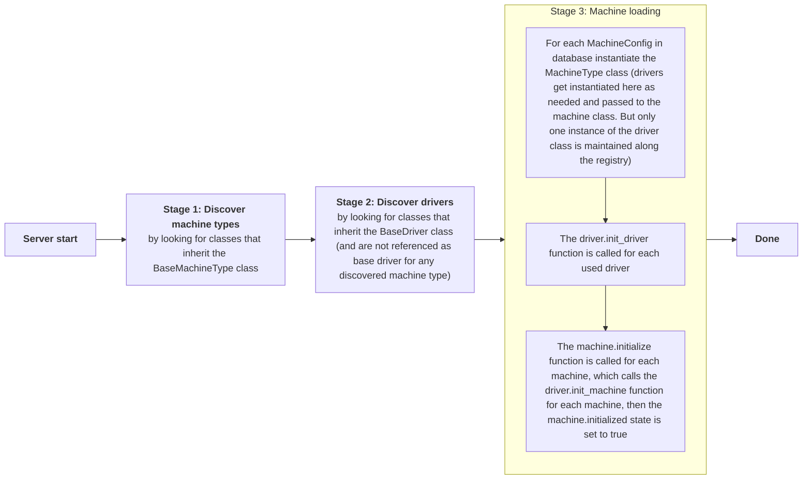

## Machines

InvenTree has a builtin machine registry. There are different machine types available where each type can have different drivers. Drivers and even custom machine types can be provided by plugins.

### Registry

The machine registry is the main component which gets initialized on server start and manages all configured machines.

#### Initialization process

The machine registry initialization process can be divided into three stages as described in this diagram:



### Machine types

Each machine type can provide a different type of connection functionality between inventree and a physical machine. These machine types are already built into InvenTree.
The machine type class gets instantiated for each machine on server startup and the reference is stored in the machine registry.

#### Built in types

| Name                            | Description                              |
| ------------------------------- | ---------------------------------------- |
| [Label printer](#label-printer) | Directly print labels for various items. |

##### Label printer

Label printer machines can directly print labels for various items in InvenTree. They replace standard [`LabelPrintingMixin`](../plugins/label.md) plugins that are used to connect to physical printers. Using machines rather than a standard `LabelPrintingMixin` plugin has the advantage that machines can be created multiple times using different settings but the same driver. That way multiple label printers of the same brand can be connected.

TODO

#### Available attributes

| Name                     | Description                                                                                                           |
| ------------------------ | --------------------------------------------------------------------------------------------------------------------- |
| `SLUG`                   | A slug for the machine type needs to be set (short identifier string that satisfies the following format `/[a-z-]+/`) |
| `NAME`                   | A name for the machine type needs to be set                                                                           |
| `DESCRIPTION`            | A description for the machine type needs to be set                                                                    |
| `base_driver`            | Reference to the base driver class                                                                                    |
| `MACHINE_SETTINGS`       | Machine settings dict, see [settings](#settings)                                                                      |
| `MACHINE_STATUS`         | Machine status enum, see [status](#machine-status)                                                                    |
| `default_machine_status` | default machine status, see [status](#machine-status)                                                                 |

#### Available methods

| Name                                                                           | Description                                                                                                           |
| ------------------------------------------------------------------------------ | --------------------------------------------------------------------------------------------------------------------- |
| `initialize(self)`                                                             | gets called on initialization                                                                                         |
| `update(self, old_machine_state: Dict[str, Any])`                              | gets called if any changes on a machine or their settings occur. The `machine.restart_required` flag can be set here. |
| `restart(self, machine: 'BaseMachineType')`                                    | gets called if the admin manually presses the restart button on the admin interface                                   |
| `handle_error(self, error: Union[Exception, str])`                             | helper function to capture errors and show them in the admin ui                                                       |
| `get_setting(self, key: str, config_type_str: Literal['M', 'D'], cache=False)` | get a setting for a machine                                                                                           |
| `set_setting(self, key: str, config_type_str: Literal['M', 'D'], value)`       | set a setting for a machine                                                                                           |
| `check_settings(self)`                                                         | check that all required settings are set                                                                              |
| `set_status(self, status: MachineStatus)`                                      | set a machine status code                                                                                             |
| `set_status_text(self, status_text: str)`                                      | set a machine status text                                                                                             |

#### Example machine type

If you want to create your own machine type, please also take a look at the already existing machine types.

```py
from django.utils.translation import ugettext_lazy as _
from machine.machine_type import BaseDriver, BaseMachineType, MachineStatus

class BaseXYZDriver(BaseDriver):
    """Base xyz driver."""

    machine_type = 'xyz'

    def my_custom_required_method(self):
        """This function must be overridden."""
        raise NotImplementedError('The `my_custom_required_method` function must be overridden!')

    def my_custom_method(self):
        """This function must be overridden."""
        raise NotImplementedError('The `my_custom_method` function must be overridden!')

    requires_override = [my_custom_required_method]

class XYZMachineType(BaseMachineType):
    SLUG = 'xyz'
    NAME = _('XYZ')
    DESCRIPTION = _('This is an awesome machine type for xyz.')

    base_driver = BaseXYZDriver

    class XYZStatus(MachineStatus):
        CONNECTED = 100, _('Connected'), 'success'
        STANDBY = 101, _('Standby'), 'success'
        PRINTING = 110, _('Printing'), 'primary'

    MACHINE_STATUS = XYZStatus

    default_machine_status = XYZStatus.DISCONNECTED
```

### Drivers

Drivers provide the connection layer between physical machines and inventree. There can be multiple drivers defined for the same machine type. Drivers are provided by plugins that are enabled and extend the corresponding base driver for the particular machine type. Each machine type already provides a base driver that needs to be inherited.

#### Available attributes

| Name               | Description                                                                                                     |
| ------------------ | --------------------------------------------------------------------------------------------------------------- |
| `SLUG`             | A slug for the driver needs to be set (short identifier string that satisfies the following format `/[a-z-]+/`) |
| `NAME`             | A name for the driver needs to be set                                                                           |
| `DESCRIPTION`      | A description for the driver needs to be set                                                                    |
| `MACHINE_SETTINGS` | Machine settings dict, see [settings](#settings) (optional)                                                     |
| (`machine_type`)   | Already set to the machine type slug by the base driver                                                         |

#### Available methods

| Name                                                                                  | Description                                                                                                            |
| ------------------------------------------------------------------------------------- | ---------------------------------------------------------------------------------------------------------------------- |
| `init_driver(self)`                                                                   | gets called on initialization before each individual machine gets initialized                                          |
| `init_machine(self, machine: 'BaseMachineType')`                                      | gets called for each machine                                                                                           |
| `update_machine(self, old_machine_state: Dict[str, Any], machine: 'BaseMachineType')` | gets called if any changes on a machine or their settings occur. The `machine.restart_required` flag can be set here.  |
| `restart_machine(self, machine: 'BaseMachineType')`                                   | gets called if the admin manually presses the restart button on the admin interface                                    |
| `get_machines(self, *, name, machine_type, driver, initialized, active, base_driver)` | helper function to get all machine, by default only initialized machines that also use the current driver are returned |
| `handle_error(self, error: Union[Exception, str])`                                    | helper function to capture errors and show them in the admin ui                                                        |

#### Example driver

A basic driver only needs to specify the basic attributes like `SLUG`, `NAME`, `DESCRIPTION`. The others are given by the used base driver, so take a look at [Machine types](#machine-types). The class will be discovered if it is provided by an **installed & activated** plugin just like this:

```py
from plugin import InvenTreePlugin
from plugin.machine import BaseXYZDriver

class CupsLabelPlugin(InvenTreePlugin):
    NAME = "CupsLabels"
    SLUG = "cups"
    TITLE = "Cups Label Printer"
    # ...

class MyXYZDriver(BaseXYZDriver):
    SLUG = 'my-abc-driver'
    NAME = 'My ABC driver'
    DESCRIPTION = 'This is an awesome driver for ABC'
```

### Settings

Each machine can have different settings configured. There are machine settings that are specific to that machine type and driver settings that are specific to the driver, but both can be specified individually for each machine. Define them by adding a `MACHINE_SETTINGS` dictionary attribute to either the driver or the machine type. The format follows the same pattern as the `SETTINGS` for normal plugins documented on the [`SettingsMixin`](../plugins/settings.md)

```py
class MyXYZDriver(BaseXYZDriver):
    MACHINE_SETTINGS = {
        'SERVER': {
            'name': _('Server'),
            'description': _('IP/Hostname to connect to the cups server'),
            'default': 'localhost',
            'required': True,
        }
    }
```

Settings can even marked as `'required': True` which prevents the machine from starting if the setting is not defined.

### Machine status

Each machine type has a set of status codes defined that can be set for each machine by the driver. There also needs to be a default status code defined.

```py
class XYZMachineType(BaseMachineType):
    # ...
    class XYZStatus(MachineStatus):
        CONNECTED = 100, _('Connected'), 'success'
        STANDBY = 101, _('Standby'), 'success'
        DISCONNECTED = 400, _('Disconnected'), 'danger'

    MACHINE_STATUS = XYZStatus
    default_machine_status = XYZStatus.DISCONNECTED
```

And to set a status code for a machine by the driver. There can also be a free text status code defined.

```py
class MyXYZDriver(BaseXYZDriver):
    # ...
    def init_machine(self, machine):
        # ... do some init stuff here
        machine.set_status(XYZMachineType.MACHINE_STATUS.CONNECTED)
        machine.set_status_text("Paper missing")
```
