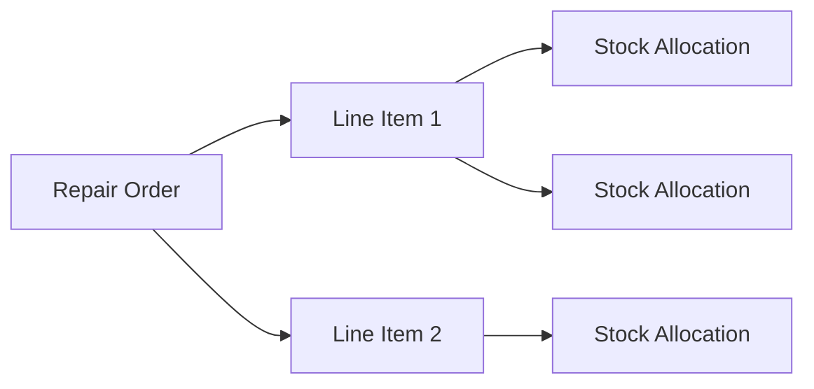
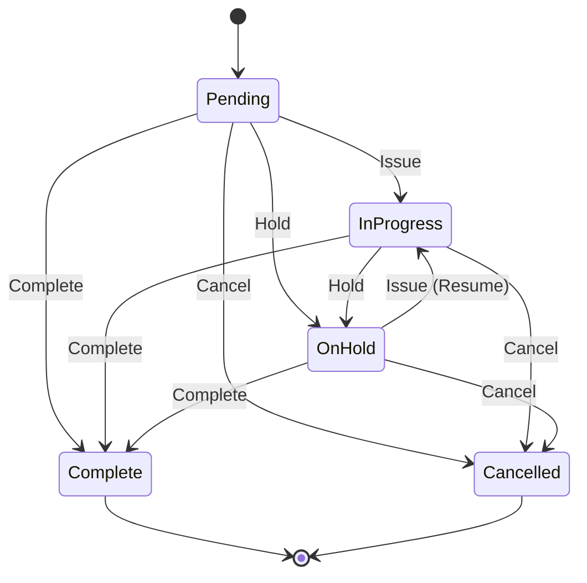

## Repair Orders

A *Repair Order* is used to manage the process of repairing or reworking existing stock items. Where a [Build Order](./build.md) creates *new* stock by assembling components, a Repair Order tracks the restoration of *existing* stock items to working condition, consuming replacement parts from inventory as needed.

Repair Orders are particularly useful for organizations that offer after-sales service, warranty repairs, or internal rework processes. Each Repair Order can optionally be linked to a [customer](../concepts/company.md), allowing you to track which customer's item is being repaired.

!!! tip "Repair vs. Build"
    Use a *Build Order* when you are manufacturing a new item from components. Use a *Repair Order* when you are fixing, refurbishing, or reworking an existing stock item.

### Key Concepts

A Repair Order consists of three core components:

| Component | Description |
| --- | --- |
| **Repair Order** | The top-level record that tracks the overall repair, including the customer, description of the issue, and current status |
| **Line Items** | Individual entries specifying which parts are required to perform the repair, and in what quantity |
| **Allocations** | Links between line items and specific stock items in inventory, reserving real stock for the repair |

## Repair Order Details

### Repair Order Reference

Each Repair Order is uniquely identified by its *Reference* field. Read more about [reference fields](../settings/reference.md).

### Repair Order Parameters

The following parameters are available for each Repair Order, and can be edited by the user:

| Parameter | Description |
| --- | --- |
| Reference | Unique repair order reference e.g. 'RO-0001' |
| Description | Description of the repair order |
| Customer | Link to the *Company* who owns the item being repaired (optional) |
| Symptoms | Detailed description of the reported symptoms or issues |
| Status | Current status of the repair order |

### Repair Order Status

Each *Repair Order* has an associated *Status* flag, which indicates the current state of the repair:

| Status | Description |
| --- | --- |
| `Pending` | Repair order has been created, but work has not yet started |
| `In Progress` | Repair work is actively underway |
| `On Hold` | Repair order has been paused, but is still considered active |
| `Complete` | Repair has been successfully completed |
| `Cancelled` | Repair order has been cancelled |

**Source Code**

Refer to the source code for the Repair Order status codes:

::: build.status_codes.RepairOrderStatus
    options:
        show_bases: False
        show_root_heading: False
        show_root_toc_entry: False
        show_source: True
        members: []

Repair Order Status supports [custom states](../concepts/custom_states.md).

### Status Lifecycle

The following diagram shows **all** valid status transitions for a Repair Order:

!!! info "Active Orders"
    Orders with a status of *Pending*, *In Progress*, or *On Hold* are considered **active** (open) orders.

!!! warning "Terminal States"
    Once a Repair Order reaches *Complete* or *Cancelled* status, it is **locked**. No further modifications can be made to the order or its line items.

## Line Items

Each Repair Order can contain one or more *Line Items*, which specify the parts required to perform the repair. A line item references a specific [Part](../part/index.md) and a required quantity.

| Field | Description |
| --- | --- |
| Repair Order | The parent repair order |
| Part | The part to be consumed for this repair |
| Quantity | The quantity of the part required |

!!! info "Example - Repair Line Items"
    A laptop is returned for repair. After diagnosis, you determine that the screen and the battery need to be replaced. You would create two line items: one for the replacement screen, and one for the replacement battery, each with a quantity of 1.

## Stock Allocations

*Stock Allocations* link a repair order line item to a specific [Stock Item](../stock/index.md) in inventory. Allocating stock to a repair order signals an *intent* to consume that stock during the repair process.

| Field | Description |
| --- | --- |
| Line Item | The repair order line item this allocation is for |
| Stock Item | The specific stock item being allocated |
| Quantity | The quantity being allocated from this stock item |

!!! warning "Stock Reservation"
    Allocating stock to a repair order does not immediately subtract the stock from inventory. It reserves the stock, indicating that it is earmarked for this particular repair. The stock is consumed when the repair order is completed.

!!! info "Multiple Allocations"
    Multiple stock items can be allocated against a single line item, if a single stock item does not have sufficient quantity for the repair.

### Stock Consumption on Completion

When a Repair Order is **completed**, all allocated stock is physically consumed (removed from inventory). The allocated quantity is subtracted from each stock item and the allocation records are deleted.

### Stock Release on Cancellation

When a Repair Order is **cancelled**, all allocation records are deleted *without* consuming stock. The reserved quantities are released back to general inventory.

## Repair Orders vs. Return Orders

Repair Orders and [Return Orders](../order/return_order.md) both deal with items coming back from customers, but they serve different purposes:

| Aspect | Repair Order | Return Order |
| --- | --- | --- |
| **Purpose** | Fix, refurbish, or rework an existing item | Receive returned goods back into inventory |
| **Stock effect** | *Consumes* replacement parts from inventory | *Receives* items back into stock |
| **Parts consumed** | Replacement parts are allocated and consumed on completion | No parts are consumed — items are received as-is |
| **Typical use case** | Warranty repair, rework, refurbishment | Product return, RMA, exchange |
| **Line items** | Parts needed *for the repair* | Items being *returned by the customer* |

!!! tip "When to use which"
    - Use a **Return Order** when a customer is sending items back and you need to receive them into your inventory (e.g., product returns, RMA processing).
    - Use a **Repair Order** when you need to *fix* an item using parts from your inventory (e.g., warranty repairs, component replacement, refurbishment).
    - The two can be used together: a Return Order receives the faulty item, and a Repair Order tracks the actual repair work.

## Repair Order Features

Repair Orders inherit a number of standard InvenTree features:

### Barcode Support

Each Repair Order can be assigned a unique [barcode](../barcodes/index.md), allowing for quick scanning and lookup.

### Attachments

File [attachments](../concepts/attachments.md) can be uploaded against a Repair Order, for example photographs of the damaged item, diagnostic reports, or customer correspondence.

### Notes

Repair Order [notes](../concepts/attachments.md) support markdown formatting, and can be used to record detailed information about the repair process.

### Tags

[Tags](../concepts/tags.md) can be assigned to Repair Orders for flexible categorization and filtering.

### Reporting

Custom [reports](../report/index.md) can be generated against each Repair Order.

## Repair Order Permissions

Access to Repair Orders is controlled by the `repair_order` [permission](../settings/permissions.md) ruleset. Users must be assigned to a group with the appropriate Repair Order permissions to create, view, edit, or delete repair orders and their associated line items and allocations.

| Permission | Description |
| --- | --- |
| View | View repair orders and their details |
| Add | Create new repair orders, line items, and allocations |
| Change | Edit existing repair orders, line items, and allocations |
| Delete | Delete repair orders, line items, and allocations |
