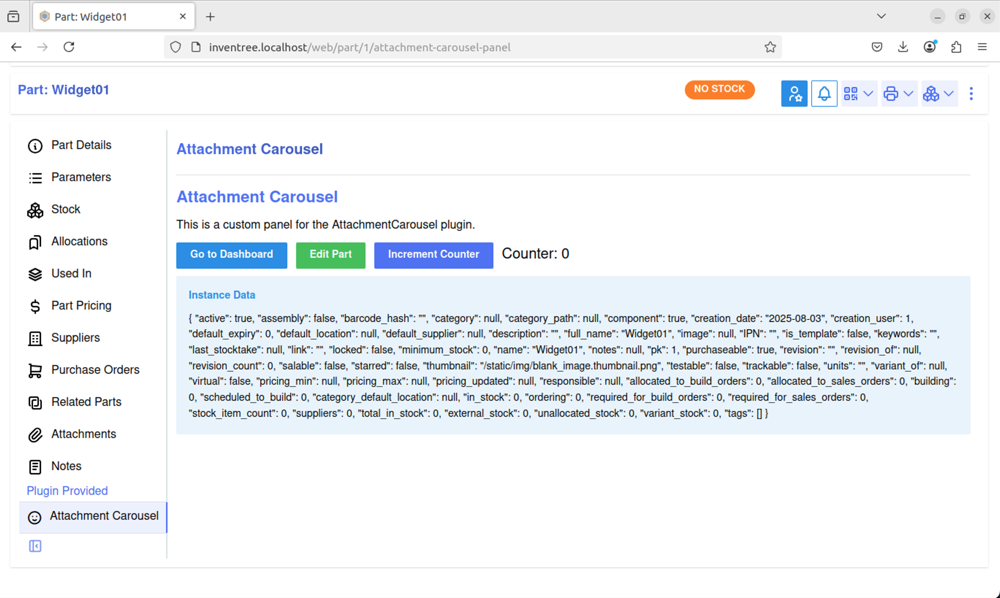

## Attachment Carousel

### Overview
A walkthrough showing how to build a part panel plugin.

By the end of the walkthrough, you will have created a plugin that adds a new part panel to display an image carousel from the images attached to the current part.


#### Prerequisites
This is a basic walkthrough and not a guide on how to code in Python or React. It is presumed you have the following,

* A running Inventree instance and/or a [devcontainer](https://docs.inventree.org/en/stable/develop/devcontainer/)
* The [Inventree Plugin Creator](https://github.com/inventree/plugin-creator) installed
* [Visual Studio Code (VS Code)](https://code.visualstudio.com/) (or an IDE of your choosing)
* [Node Package Manager](https://www.npmjs.com/) installed
* Basic Python knowledge
* Basic React knowledge
* Optional:
    * Vite knowledge
    * [Mantine UI](https://mantine.dev/) knowledge ([Inventree and Mantine UI](./mixins/ui.md#mantine))


### Creating the Plugin Environment
Create a new empty folder called `Inventree` and open it in `VS Code`. In VS Code launch a new terminal window and run the following command,

``` bash
create-inventree-plugin
```

After the plugin wizard has launched, enter the name as `Attachment Carousel` and fill out the other questions until you reach the plugin structure information questions.


At the plugin structure information questions,

* Only select `UserInterfaceMixin` and `SettingsMixin`
* `Add User Interface Support`
* Only select `Custom panel items`
* Select `No` for `Enable translation support`
* Select `No` for `Git Integration`


After the Plugin Creator has finished you should have a new project that looks like this (seen here in VS Code),


#### A Brief Overview of the Environment

`attachment_carousel` contains several files, but the main file is `core.py` which is the Python entry point for the plugin. Once created, this folder will also contain the bundled frontend code and any [static file assets](./index.md#static-files).

`frontend/src` contains `Panel.tsx' which is the frontend React TypeScript code.

### Testing the Plugin Environment
To ensure the environment is working as expected, from the terminal navigate to the `frontend` directory and run either the development server (if using the development environment) **or** build the project and install the plugin.

Development Environment

``` Bash
npm install
npm run dev
```

Generic Build and install

``` Bash
npm install
npm run build
```

Copy the built `attachment_carousel` directory to the `inventree-data/plugins` directory and enable it via the admin interface.



!!! info "Tip"
    If you do not see the `Attachment Carousel` panel listed, make sure you have `Enable interface integration` turned on (it is disabled by default)


### Creating the Carousel

Mantine UI provides an easy-to-use [Carousel](https://mantine.dev/x/carousel/) component that will be used in this walkthrough.

As the Mantine UI carousel is not added to the plugin project by default, add it via the terminal,

``` Bash
npm install @mantine/carousel
```

Edit `Panel.tsx` to add the carousel references,

``` TypeScript
import { MantineProvider } from '@mantine/core'
import AttachmentCarousel from './AttachmentCarousel.tsx';

// Import for type checking
import { checkPluginVersion, type InvenTreePluginContext } from '@inventreedb/ui';

/**
 * Render a custom panel with the provided context.
 * Refer to the InvenTree documentation for the context interface
 * https://docs.inventree.org/en/latest/plugins/mixins/ui/#plugin-context
 */
function AttachmentCarouselPanel({context}: {context: InvenTreePluginContext;}) {
    console.log(context);
    return (
        <>
            <MantineProvider>
                <AttachmentCarousel />
            </MantineProvider>
        </>
    );
}

// This is the function which is called by InvenTree to render the actual panel component
export function renderAttachmentCarouselPanel(context: InvenTreePluginContext) {
    checkPluginVersion(context);
    return <AttachmentCarouselPanel context={context} />;
}
```

Create a new file called `AttachmentCarousel.tsx` and add the carousel code,

``` TypeScript

import { Carousel } from '@mantine/carousel';
import { Image, AspectRatio } from '@mantine/core';

export default function AttachmentCarousel() {

  const indicators = true
  const loop = true
  const imageUrls = [
    'https://picsum.photos/1920/1080?random=1',
    'https://picsum.photos/1920/1080?random=2',
    'https://picsum.photos/1920/1080?random=3',
    // Add more image URLs here. See https://picsum.photos/ for more information
  ];

  const slides = imageUrls.map((url) => (
    <Carousel.Slide key={url}>
      <Image src={url} />
    </Carousel.Slide>
  ));

  return (
    <AspectRatio ratio={1920 / 1080} >
      <Carousel withIndicators={indicators} emblaOptions={{loop:loop}} styles={{control: {backgroundColor: 'var(--mantine-color-white)', color: 'var(--mantine-color-black)'}, indicator: {backgroundColor: 'var(--mantine-color-white)'}}}>{slides}</Carousel>
    </AspectRatio>
  );
}

```

As detailed earlier, run/build the plugin. You should now see that the plugin has been update to show a carousel.


### Connecting the Carousel to Inventree Part Attachments via the Frontend

Currently, the panel displays randomly generated images from https://picsum.photos. To make it more useful, we can get the images from files that are attached to the part via a frontend API query.

Install TanStack Query in our project via the terminal

``` Bash
npm install @tanstack/react-query
```

Update `Panel.tsx` to add a TanStack `QueryClientProvider` and send the context to the attachment carousel,

``` diff
import { MantineProvider } from '@mantine/core'
import AttachmentCarousel from './AttachmentCarousel';
+import { QueryClientProvider } from '@tanstack/react-query';
...
function AttachmentCarouselPanel({context}: {context: InvenTreePluginContext;}) {
-   console.log(context);
    return (
        <>
+            <QueryClientProvider client={context.queryClient}>
                <MantineProvider>
-                    <AttachmentCarousel />
+                    <AttachmentCarousel context={context} />
                </MantineProvider>
+            </QueryClientProvider>
        </>
    );
}
...
```
!!! info "More Info"
    By providing the `context`, we can use the context api query to avoid the need to pass an API key or have the user login to perform the API call, it just happens automatically.

Update `Attachment_carousel.tsx` to use TanStack Query and query for all part attachments,

``` TypeScript

import { Carousel } from '@mantine/carousel';
import { Image, AspectRatio } from '@mantine/core';
import { useQuery } from '@tanstack/react-query';

export default function AttachmentCarousel({context}: { context: any }) {

    const indicators = true
    const loop = true
    const vaildAttachmentTypes: string[] = ["jpg", "jpeg"] // Add more items to the array if you want to support more file types.
    let imageUrls: string[] = new Array();

    const { data: attachments } = useQuery({
      queryKey: ["attachment"],
      queryFn: async () => {
        const response = await context.api?.get('api/attachment/', {
          params: {
                  model_type: context.model,
                  model_id: context.id,
                  is_file: true,
                  limit: 100
                }
        })
        return await response.data.results
      }
    })

    if (attachments) {
      attachments.forEach((element: { attachment: string; filename: string; }) => {
        if (vaildAttachmentTypes.includes(element.filename.split('.').pop() || "")) {
          imageUrls.push(context.globalSettings.getSetting("INVENTREE_BASE_URL") + element.attachment);
        }
      });
    }
    else {
      imageUrls = [""];
    }

    const slides = imageUrls.map((url) => (
      <Carousel.Slide key={url}>
        <Image src={url} />
      </Carousel.Slide>
    ));

  return (
    <AspectRatio ratio={1920 / 1080} >
      <Carousel withIndicators={indicators} emblaOptions={{loop:loop}} styles={{control: {backgroundColor: 'var(--mantine-color-white)', color: 'var(--mantine-color-black)'}, indicator: {backgroundColor: 'var(--mantine-color-white)'}}}>{slides}</Carousel>
    </AspectRatio>
  );
}

```

Upload some appropriately sized images in the specified file type (see code), re-bundle the plugin, and update it in Inventree.

You should now see the carousel displaying images from the attachments on the part. Upload images to different parts and see how the carousel changes based on the part you are viewing.


### Connecting the Carousel to Inventree Part Attachments via the Backend

An alternative to doing the API query on the frontend is to do it via the backend and supply the image URLs via additional context data. The advantage of doing the query this way is the panel can now be shown or hidden based on if any images are found on the part, and the images could also be checked to ensure they are images and not corrupted etc. The downsides are, there is more backend processing, the context variable could become quite large when passed to the frontend and the carousel will not automatically see new attachments as the backend is only run when the page is first loaded. Of course, queries could be done on the backend and frontend and not pass the data via the context. It is for the developer of the plugin to decide which approach is best...

Back to the walkthrough, open `core.py` in the `attachment_carousel` folder and make the following changes,

``` Diff
  from plugin import InvenTreePlugin
+ from part.models import Part
+ from common.models import InvenTreeSetting
+ from django.db.models import Q
  from plugin.mixins import SettingsMixin, UserInterfaceMixin

  from . import PLUGIN_VERSION
  ...
  ...
    def get_ui_panels(self, request, context: dict, **kwargs):
        """Return a list of custom panels to be rendered in the InvenTree user interface."""

        panels = []
+       base_url = InvenTreeSetting.get_setting('INVENTREE_BASE_URL')

        # Only display this panel for the 'part' target
        if context.get('target_model') == 'part':

+           part = Part.objects.get(pk=context.get('target_id'))
+           part_attachments = part.attachments
+           attachments = part_attachments.filter(Q(attachment__endswith='.jpg') | Q(attachment__endswith='.jpeg'))

+           attachment_urls = []

+           if attachments.count() > 0:
+               for attachment in attachments:
+                   attachment_urls.append(base_url + '/media/' + attachment.attachment.name)

+           if len(attachment_urls) > 0:
                panels.append({
                    'key': 'attachment-carousel-panel',
                    'title': 'Attachment Carousel',
                    'description': 'Custom panel description',
                    'icon': 'ti:carousel-horizontal:outline',
                    'source': self.plugin_static_file('Panel.js:renderAttachmentCarouselPanel'),
                    'context': {
                        # Provide additional context data to the panel
                        'settings': self.get_settings_dict(),
-                       'foo': 'bar'
+                       'attachments': attachment_urls,
                    }
                })

        return panels
```

Now the backend collects the attachment details and passes them to the frontend, whilst also only displaying the panel if attachments are found.

Next, modify `AttachmentCarousel.tsx` to use this new information,

``` Diff
  import { Carousel } from '@mantine/carousel';
  import { Image, AspectRatio } from '@mantine/core';
- import { useQuery } from '@tanstack/react-query';

  export default function Test({ context }: { context: any }) {

    const indicators = true
    const loop = true
+   const imageUrls: string[] = context.context.attachments;
-   const vaildAttachmentTypes: string[] = ["jpg", "jpeg"] // Add more items to the array if you want to support more file types.
-   let imageUrls: string[] = new Array();
-   const { data: attachments } = useQuery({
-     queryKey: ["attachment"],
-     queryFn: async () => {
-       const response = await context.api?.get('api/attachment/', {
-         params: {
-                 model_type: context.model,
-                 model_id: context.id,
-                 is_file: true,
-                 limit: 100
-               }
-       })
-       return await response.data.results
-     }
-   })

-   if (attachments) {
-     attachments.forEach((element: { attachment: string; filename: string; }) => {
-       if (vaildAttachmentTypes.includes(element.filename.split('.').pop() || "")) {
-         imageUrls.push(context.globalSettings.getSetting("INVENTREE_BASE_URL") + element.attachment);
-       }
-     });
-   }
-   else {
-     imageUrls = [""];
-   }

    const slides = imageUrls.map((url) => (
      <Carousel.Slide key={url}>
        <Image src={url} />
      </Carousel.Slide>
    ));

    return (
      <AspectRatio ratio={1920 / 1080} >
        <Carousel withIndicators={indicators} loop={loop}>{slides}</Carousel>
      </AspectRatio>
    );
  }

```

Again, re-bundle the plugin, and update it in Inventree.

You should now see the carousel displaying images from the attachments on the part, but this time they are passed via context from the backend.


### Changing the Panel Icon

Inventree uses [Tabler icons](https://tabler.io/icons) and it is easy to change the panel's icon to something more suitable. Simply find the [Tabler icon](https://tabler.io/icons) you would like and update the icon reference in `core.py`,

``` Diff
panels.append({
    'key': 'attachment-carousel-panel',
    'title': 'Attachment Carousel',
    'description': 'Custom panel description',
-   'icon': 'ti:mood-smile:outline',
+   'icon': 'ti:carousel-horizontal:outline',
    'source': self.plugin_static_file('Panel.js:renderAttachmentCarouselPanel'),
    'context': {
        # Provide additional context data to the panel
        'settings': self.get_settings_dict(),
        'attachments': attachment_urls,
    }
})
```


### Adding Plugin Admin Options

Plugin settings can be added to allow the end user to change certain settings from the admin panel.

In this walkthrough add settings to allow the user to show/hide the `indicators` (the pill buttons at the bottom of the panel) and enable/disable `loop` functionality (the ability to loop through all the images).

Make the following changes to `core.py`,

``` Diff
...
  SETTINGS = {
      # Define your plugin settings here...
-     'CUSTOM_VALUE': {
-         'name': 'Custom Value',
-         'description': 'A custom value',
-         'validator': int,
-         'default': 42,
-     }
+     'ENABLE_INDICATORS': {
+         'name': 'Indicators',
+         'description': 'Show navigation indicators',
+         'validator': bool,
+         'default': True,
+     },
+     'ENABLE_LOOP': {
+         'name': 'Loop',
+         'description': 'Loop through images',
+         'validator': bool,
+         'default': True,
+     }
}
...
```

Edit `AttachmentCarousel.tsx` to use the new options,

``` Diff
export default function App({ context }: { context: any }) {

- const indicators = true
- const loop = false
+ const indicators = context.context.settings.ENABLE_INDICATORS
+ const loop = context.context.settings.ENABLE_LOOP
  const imageUrls: string[] = context.context.attachments;
```

Now you have two options that change the behaviour of the plugin.


### Using CSS to Enhance the End User Experience

When `loop` is set to `disabled` the carousel still displays the previous and next buttons for the first and last images. This behaviour can be changed with some CSS.

Create a new file called `AttachmentCarousel.css` and add the following,

``` CSS
.control {
  &[data-inactive] {
    opacity: 0;
    cursor: default;
  }
}

.control:hover {
  &[data-inactive] {
    opacity: 0;
    cursor: default;
  }
}
```

Update `AttachmentCarousel.tsx` to reference to this stylesheet and the default Mantine Carousel styles,

```diff
import { Carousel } from '@mantine/carousel';
import { Image, AspectRatio } from '@mantine/core';
+ import '@mantine/carousel/styles.css'; // Import Mantine Carousel styles
+ import './AttachmentCarousel.css'; // Import custom styles for the carousel
...
```

Update `AttachmentCarousel.tsx` to use the new styles,

```diff
...

<AspectRatio ratio={1920 / 1080} >
-<Carousel withIndicators={indicators} emblaOptions={{loop:loop}} styles={{control: {backgroundColor: 'var(--mantine-color-white)', color: 'var(--mantine-color-black)'}, indicator: {backgroundColor: 'var(--mantine-color-white)'}}}>{slides}</Carousel>
+<Carousel withIndicators={indicators} emblaOptions={{loop:loop}} classNames={{control: 'control'}}>{slides}</Carousel>
</AspectRatio>

...
```

Vite will automatically bundle all the CSS files in the project to `static/assets/style.css`, but it will not automatically add a reference to the stylesheet. Add the reference manually to `Panel.tsx`,

``` diff
...
function AttachmentCarouselPanel({context}: {context: InvenTreePluginContext;}) {
    console.log(context);
    return (
        <>
+           <link rel="stylesheet" href={`${context.host}static/plugins/${context.context.slug}/assets/style.css`} />
            <QueryClientProvider client={context.queryClient}>
                <MantineProvider>
                    <AttachmentCarousel context={context} />
                </MantineProvider>
            </QueryClientProvider>
        </>
    );
}
...
```

The reference requires the host and the [plugin-name](./index.md##static-files). Rather than statically coding these references, the host reference may be retrieved via the context and the plugin-name may be passed via additional context data. In this example it is passed as the `slug`, as by default the slug is the plugin name. Add this additional context data via `core.py`,

``` diff
panels.append({
    'key': 'attachment-carousel-panel',
    'title': 'Attachment Carousel',
    'description': 'Custom panel description',
    'icon': 'ti:carousel-horizontal:outline',
    'source': self.plugin_static_file('Panel.js:renderAttachmentCarouselPanel'),
    'context': {
        # Provide additional context data to the panel
        'settings': self.get_settings_dict(),
        'attachments': attachments_urls,
+       'slug': self.SLUG
    }
})
```

Update the plugin in Inventree and the walkthrough is complete!


