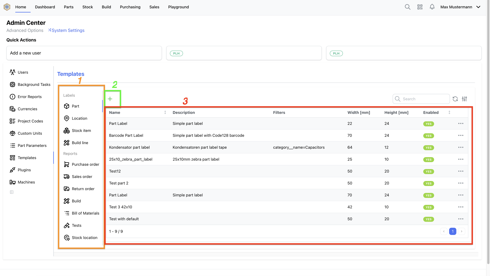
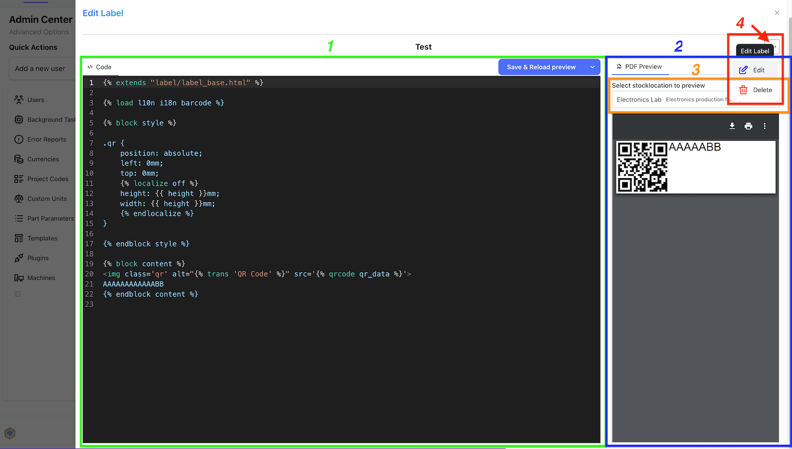

## Template editor

The Template Editor is integrated into the [Admin Center](../settings//admin.md#admin-center) of the Web UI. It allows users to create and edit label and report templates directly with a side by side preview for a more productive workflow.

On the left side (1) are all possible possible template types for labels and reports listed. With the "+" button (2), above the template table (3), new templates for the selected type can be created. To switch to the template editor click on a template.

### Editing Templates

The Template Editor provides a split pane interface, with a [code editor (1)](#code-editor-1) on the left and a [preview area (2)](#previewing-templates-2) on the right. The split view can be resized as required with the drag handler in-between.

#### Code editor (1)

The code editor supports syntax highlighting and making it easier to write and edit templates.

#### Previewing Templates (2)

One of the key features of the Template Editor is the ability to preview the rendered output of the templates. Users can select an InvenTree item (3) to render the template for, allowing them to see how the final output will look in production.

To render the preview currently **overriding the production template is required** due to API limitations. To do so, first select an item (3) to use for the preview and then press the "Save & Reload preview" button at the top right of the code editor. The first time a confirm dialog opens that you need to confirm that the production template now will be overridden.

If you don't want to override the template, but just render a preview for a template how it is currently stored in InvenTree, click on the down arrow on the right of that button and select "Reload preview". That will just render the selected item (4) with the InvenTree stored template.

#### Edit template metadata

Editing metadata such as name, description, filters and even width/height for labels and orientation/page size for reports can be done from the edit modal accessible when clicking on the three dots (4) and select "Edit" in the dropdown menu.
