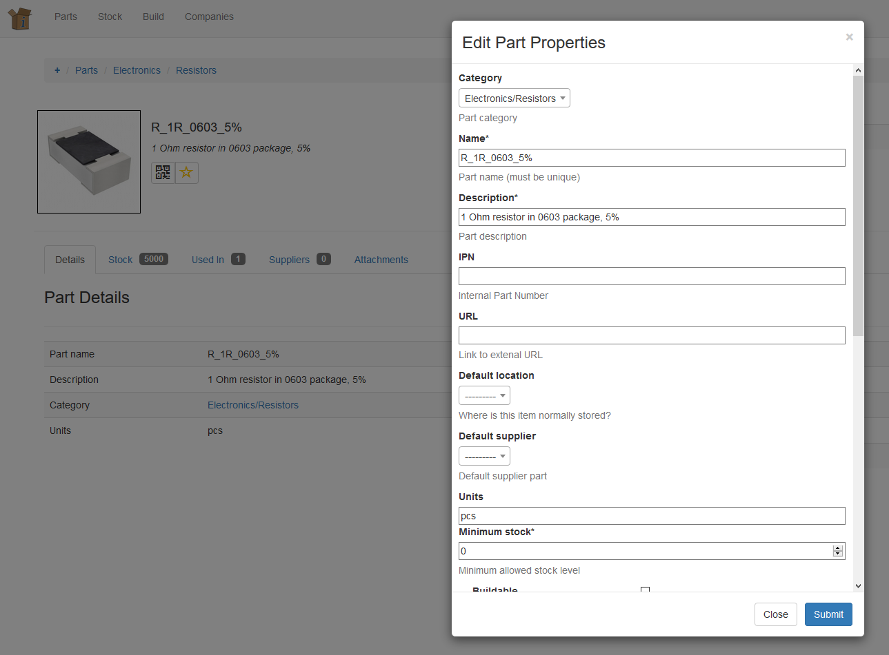

InvenTree Modal Forms
=====================

.. toctree::
   :titlesonly:
   :maxdepth: 2
   :caption: Modal Forms
   :hidden:

The InvenTree web interface uses modal forms for user input. InvenTree defines a wrapper layer around the Django form classes to provide a mechanism for retrieving and rendering forms via jQuery and AJAX.

Forms are rendered to a Bootstrap modal window, allowing in-page data input and live page updating.

Crispy Forms
------------

Django provides native form rendering tools which are very powerful, allowing form rendering, input validation, and display of error messages for each field.

InvenTree makes use of the `django-crispy-forms <https://github.com/django-crispy-forms/django-crispy-forms>`_ extension to reduce the amount of boilerplate required to convert a Django model to a HTML form.

Form Rendering
--------------

The InvenTree front-end web interface is implemented using jQuery and Bootstrap. Forms are rendered using Django `class-based forms <https://docs.djangoproject.com/en/2.2/topics/class-based-views/generic-editing/>`_ using standard Django methods. 

The main point of difference is that instead of rendering a HTTP response (and displaying a static form page) form data are requested via AJAX, and the form contents are injected into the modal window.

A set of javascript/jQuery functions handle the client/server interactions, and manage GET and POST requests.

Sequence of Events
------------------

#. User presses a button or other element which initiates form loading
#. jQuery function sends AJAX GET request to InvenTree server, requesting form at a specified URL
#. Django renders form (according to specific model/view rules)
#. Django returns rendered form as a JSON object
#. Client displays the modal window and injects the form contents into the modal
#. User fills in form data, presses the 'Submit' button
#. Client sends the completed form to server via POST
#. Django backend handles POST request, specifically determines if the form is valid
#. Return a JSON object containing status of form validity
  * If the form is valid, return (at minimum) ``{form_valid: true}``. Client will close the modal.
  * If the form is invalid, re-render the form and send back to the client. Process repeats

At the end of this process (i.e. after successful processing of the form) the client closes the modal and runs any optional post-processes (depending on the implementation).

Further Reading
---------------

For a better understanding of the modal form architecture, refer to the relevant source files:

**Server Side:** Refer to ``./InvenTree/InvenTree/views.py`` for AJAXified Django Views

**Client Side:** Refer to ``./InvenTree/static/script/inventree/modals.js`` for client-side javascript
