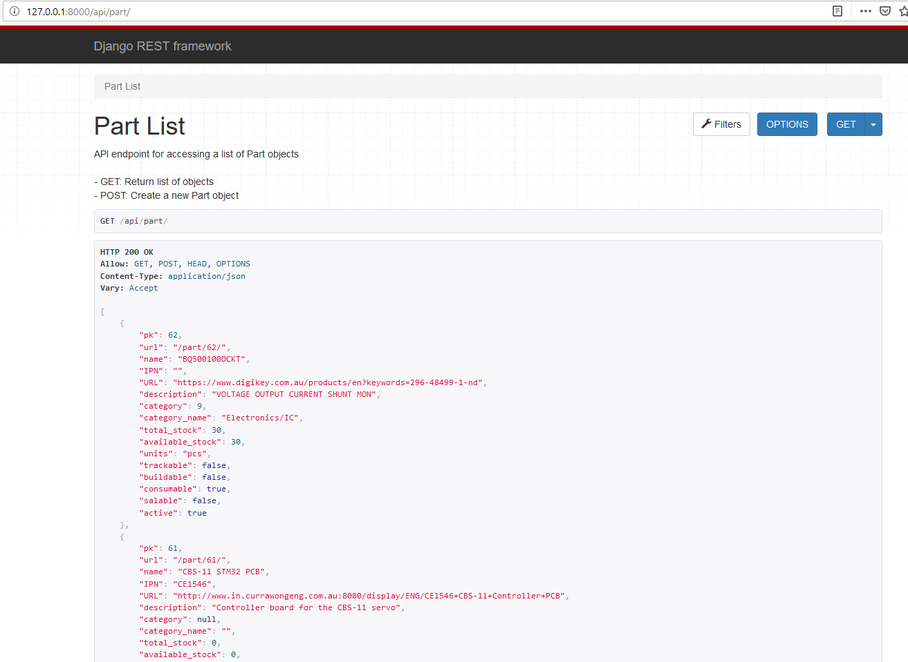
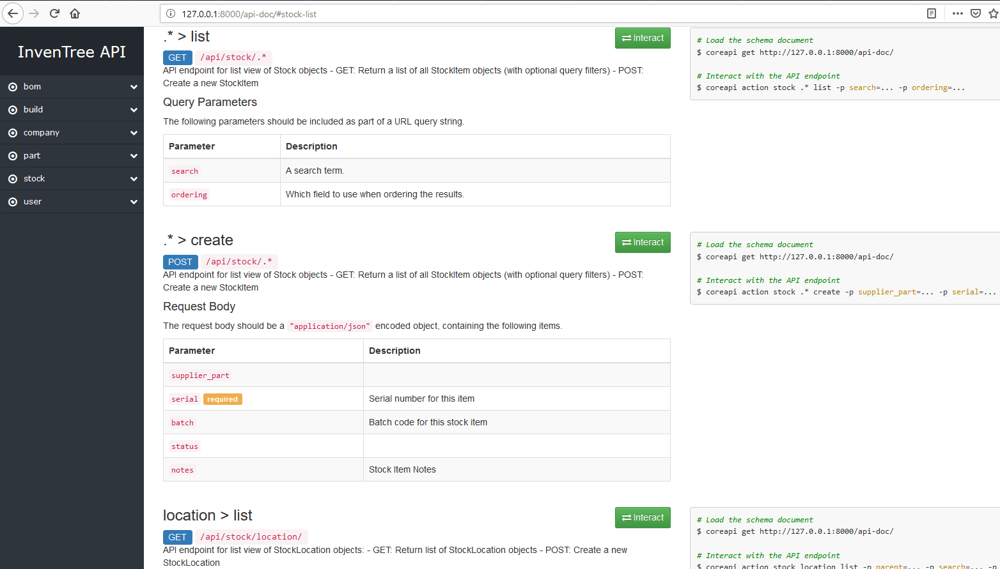

REST API
========

.. toctree::
   :titlesonly:
   :maxdepth: 2
   :caption: REST API
   :hidden:

InvenTree provides a REST API which serves data to the web client and also provides data access to third-party applications. The REST API is implemented using the `Django REST framework (DRF) <https://www.django-rest-framework.org/>`_ which provides the following features out of the box:

* AJAX REST API
* Web-browseable REST
* User authentication 
* Database model serialization and validation

API Access
----------

The API is accessible from the root URL ``/api/``. It requires user authentication.

* Requesting data via AJAX query will return regular JSON objects. 
* Directing a browser to the API endpoints provides a web-browsable interface

API Documentation
-----------------

API documentation is provided by DRF autodoc tools, and is available for browsing at ``/api-doc/``

API Code
--------

Javascript/jQuery code for interacting with the server via the REST API can be found under ``InvenTree/static/script/InvenTree``.

Python interface
----------------

A Python library for interacting with the InvenTree API is provided on `GitHub <https://github.com/inventree/inventree-python>`_