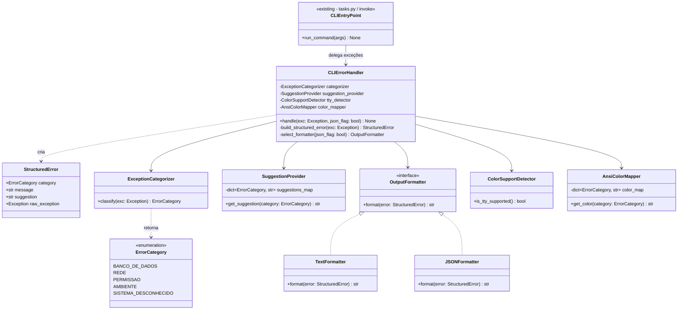
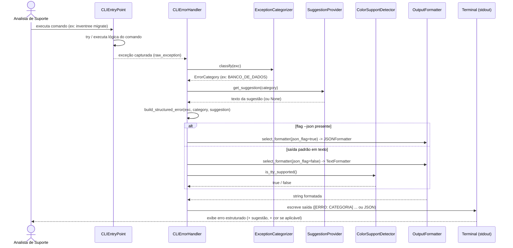
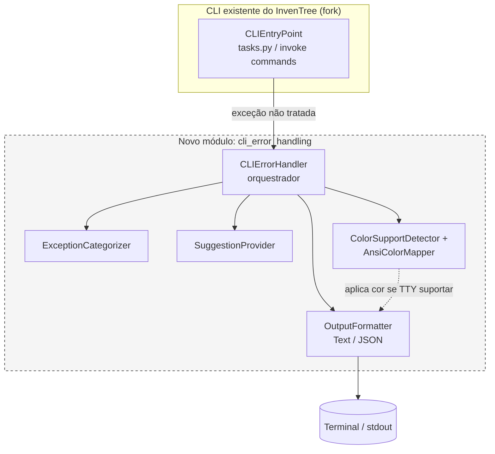

# 3.9 / 3.10 — Modelagem UML

Ferramenta: **Mermaid**

MVP: Padronização e Semântica de Saídas de Erro via CLI com Guia de Resolução Acoplado

Os diagramas combrem principalmente o fluxo de **US01**, que é implementado no PR 

---

## Diagrama de Classes 

- `ExceptionCategorizer` concentra a lógica da **US01** (categorização).
- `SuggestionProvider` é o ponto de extensão da **US02**.
- `TextFormatter`/`JSONFormatter` (padrão Strategy) resolvem a **US04** (flag `--json`) sem duplicar lógica de formatação.
- `ColorSupportDetector` + `AnsiColorMapper` cobrem a **US05**, isolando a checagem de TTY (evita "vazar" ANSI em terminais sem suporte, conforme o cenário de teste).
- `CLIEntryPoint` representa o ponto de integração real no fork (ex.: `tasks.py`/`invoke`), sem precisar ser reescrito — ele só passa a delegar exceções para `CLIErrorHandler`.

---

## Diagrama de Sequencia

---

## Diagrama de Componentes

- O componente `cli_error_handling` é **novo** e isolado — não altera a lógica de negócio existente do InvenTree, apenas intercepta exceções não tratadas na camada de CLI, conforme justificado em `definicao_do_mvp` ("não demanda refatorações na lógica central de negócios").
- Essa separação em componente próprio facilita o PR: o diff fica concentrado em um módulo novo + um ponto de integração mínimo no `CLIEntryPoint`.
