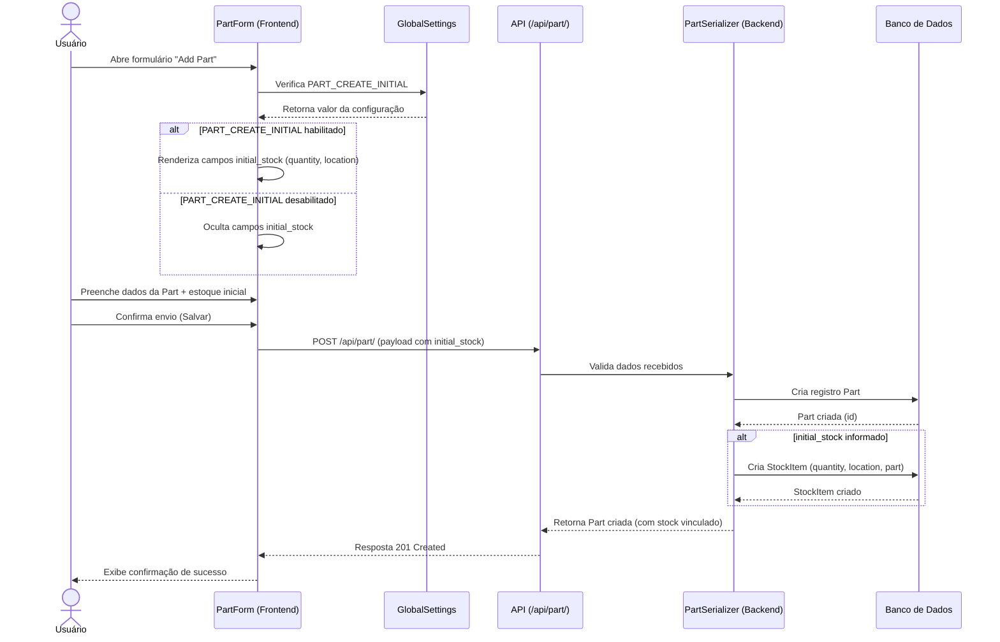

# Diagrama de Sequencia
Baseando-se no MVP proposto para a issue ([#12266](https://github.com/inventree/InvenTree/issues/12266)) obtemos o seguinte diagrama de sequencia:

```mermaid
    sequenceDiagram
    actor Usuário
    participant Form as PartForm (Frontend)
    participant Settings as GlobalSettings
    participant API as API (/api/part/)
    participant Serializer as PartSerializer (Backend)
    participant DB as Banco de Dados
 
    Usuário->>Form: Abre formulário "Add Part"
    Form->>Settings: Verifica PART_CREATE_INITIAL
    Settings-->>Form: Retorna valor da configuração
 
    alt PART_CREATE_INITIAL habilitado
        Form->>Form: Renderiza campos initial_stock (quantity, location)
    else PART_CREATE_INITIAL desabilitado
        Form->>Form: Oculta campos initial_stock
    end
 
    Usuário->>Form: Preenche dados da Part + estoque inicial
    Usuário->>Form: Confirma envio (Salvar)
 
    Form->>API: POST /api/part/ (payload com initial_stock)
    API->>Serializer: Valida dados recebidos
    Serializer->>DB: Cria registro Part
    DB-->>Serializer: Part criada (id)
 
    alt initial_stock informado
        Serializer->>DB: Cria StockItem (quantity, location, part)
        DB-->>Serializer: StockItem criado
    end
 
    Serializer-->>API: Retorna Part criada (com stock vinculado)
    API-->>Form: Resposta 201 Created
    Form-->>Usuário: Exibe confirmação de sucesso
```

